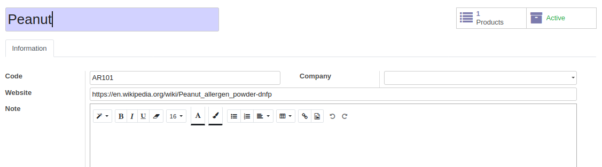
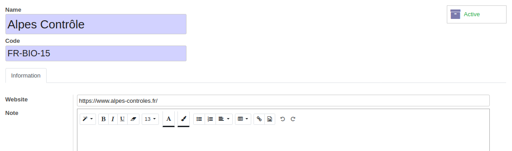
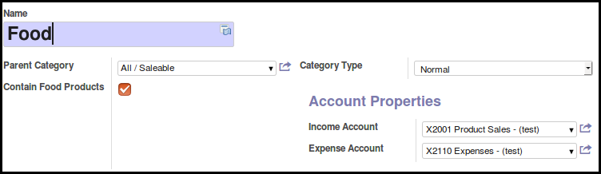
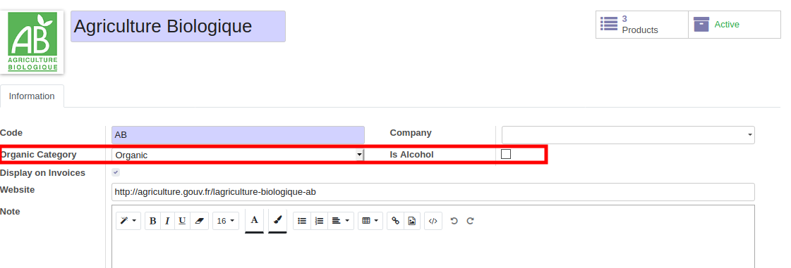

* Go to 'Sale > Configuration > Allergens' and create new items.

* Go to 'Sale > Configuration > Certifier Organizations' and create new items.

* Go to 'Inventory > Configuration > Product Categories' and check new
  field ``is_alimentary`` for categories that contains food products.

* Go to 'Sale > Configuration > Product Labels' and update your labels,
  setting two new fields ``organic_type`` and ``is_alcohol``.

