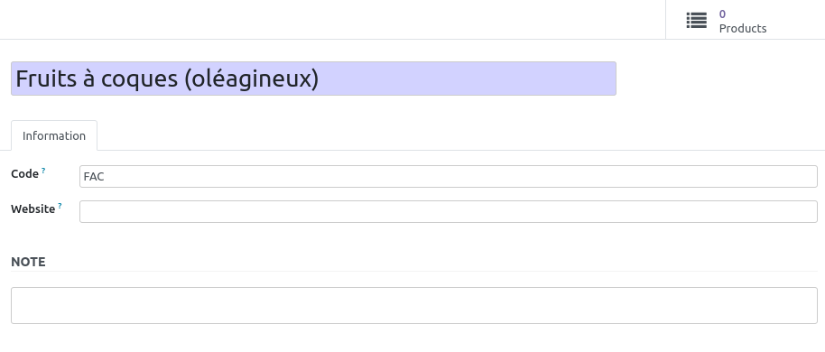
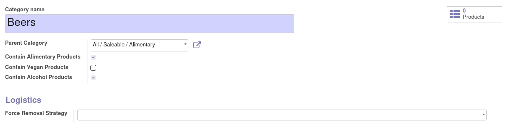
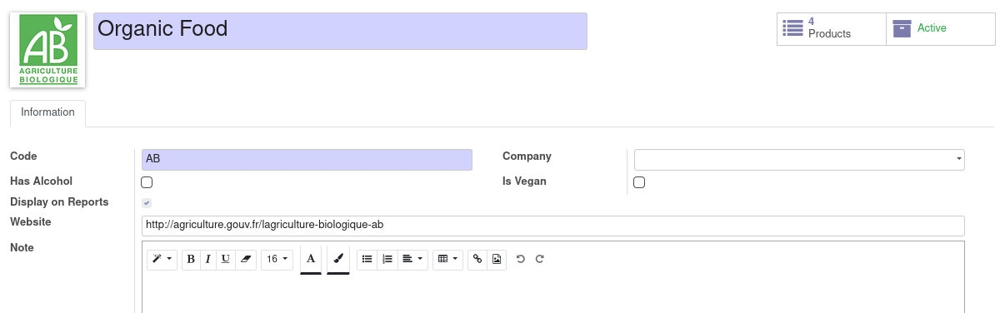

* Go to 'Sale > Configuration > Allergens' and create new items.

* Go to 'Inventory > Configuration > Product Categories' and check new fields:
    * ``Contain Alimentary Products``
    * ``Contain Vegan Products``
    * ``Contain Alcohol Products``

* Go to 'Sale > Configuration > Product Labels' and update your labels,
  setting two new fields ``Has Alcohol`` and ``Is Vegan``.

