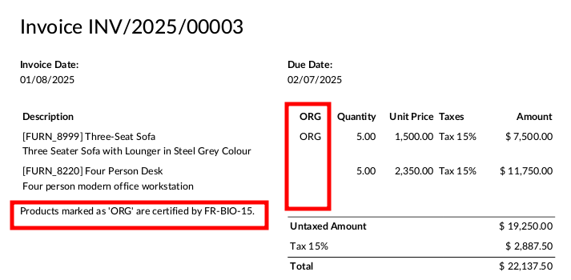

This module is a glue module, auto installed when ``product_food_certification`` and ``account`` are installed.

It adds a new column on invoice report, to mention if products are organic.

It also add a new text that specify which organization are certifying the products.

This information is required by law.

