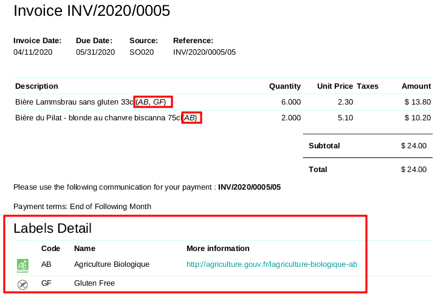

This module extends the functionality of Product module to support labels
on products.

The field is defined on ``product.product`` model and can be set also
on ``product.template`` models, in a mono variant context.

If the checkbox ``display_on_report`` is checked on the label,
it will be displayed on the official document. (quotation, invoices...)

