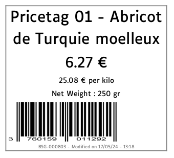
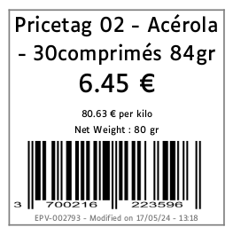
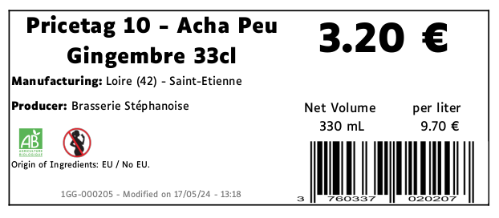
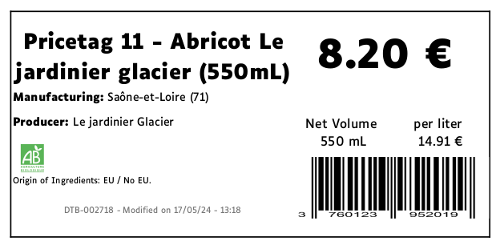
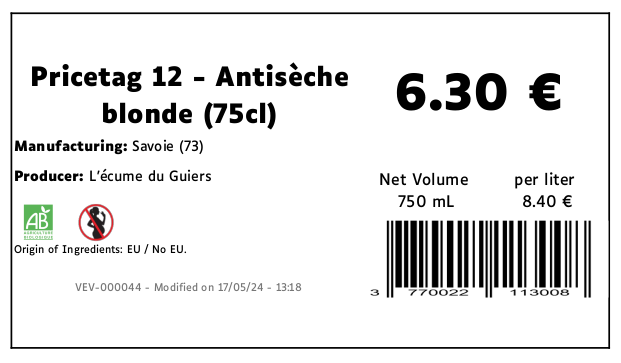
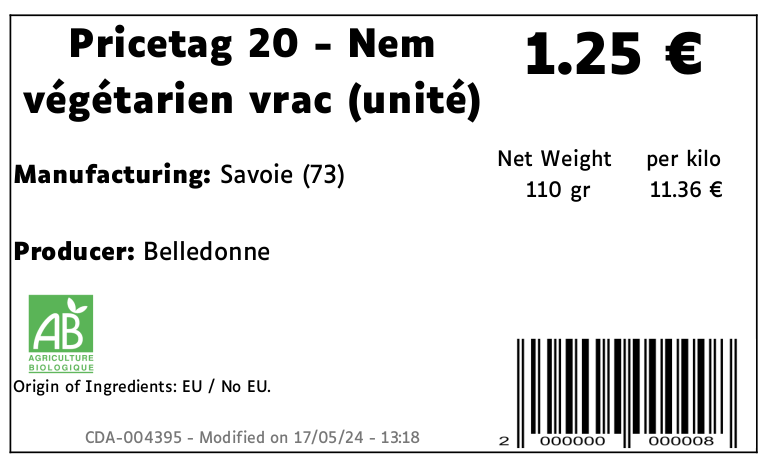
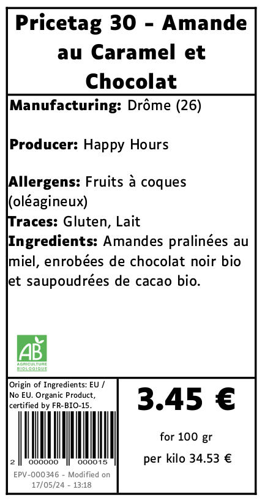
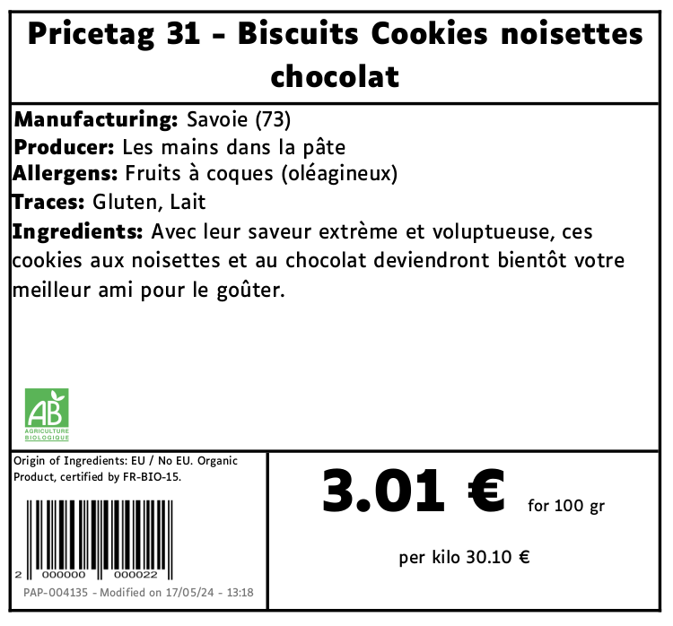
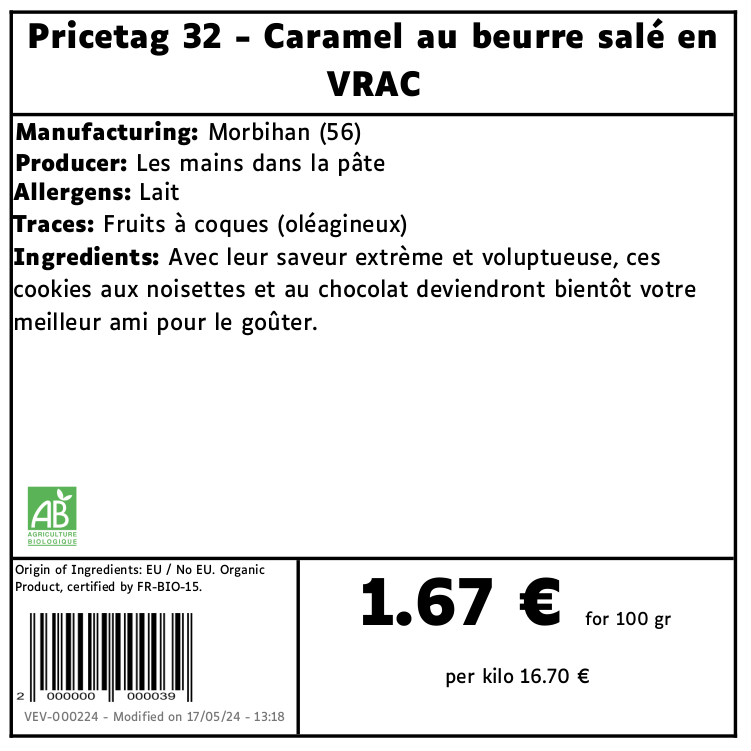

This module extends product_print_category by adding nice reports food
related. At the moment, we create five different pricetag reports.

Specifications :

- We add a `pricetag_type` which permits to assign a color for the
  pricetags.
- We can choose a second unity of measure in order to display the price
  with a more appropriate unity (for example for very expensive
  products)
- Thanks to `product_food` module, ingredients, allergens are displayed
  in bulk reports
- Thanks to `product_label` and `product_origin` modules, we also
  display labels and production origin
- Thanks to `product_food_certification` extra text can be displayed,
  depending if the company is certified, if an organic label is
  selected, if the product is sold by kilogram, etc...

Here is what's look like the reports :

## Pricetag n°01

## Pricetag n°02

## Pricetag n°10

## Pricetag n°11

## Pricetag n°12

## Pricetag n°20

## Pricetag n°30

## Pricetag n°31

## Pricetag n°32

