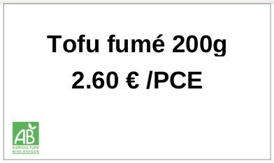

This module extends product_print_category by adding nice reports food related.
At the moment, we create five different pricetag reports.

Specifications :

- We add a ``pricetag_type`` which permits to assign a color for the pricetags.

- We can choose a second unity of measure in order to display the price with a more appropriate unity (for example for very expensive products)

- Thanks to product_food module, ingredients, allergens are displayed in bulk reports

- Thanks to product_label and product_origin, we also display labels and origin

Here is what's look like the reports :

- Normal pricetag "classic format" 76x31mm

- Bulk pricetag long designed for Applimage bulk equipment 52x101mm

- Bulk pricetag square 93x93mm

- Square pricetag 40x36mm

- Counter pricetag - 72*123mm

