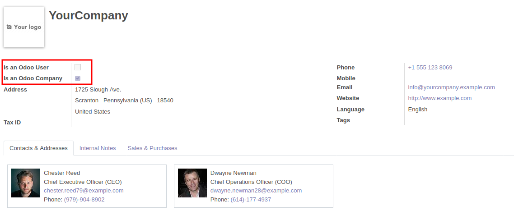

In Odoo, a user has a partner associated. This feature is great to manage
commun fields, but generate some non desired behaviours in some multi company
cases:

If a user has multi company access, the company of the associated partner will
change when the user change company. So the associated partner will be
"available or not", depending of user configuration. This generates error
access.

With this module:

* the users partners will not be accessible by default.
  This will force saler / purchaser to create new partner
  (if the user is a customer or a supplier too)

* the users partners will have no company, this will fix all bug access

* the companies partners will not be accessible by default.
  This will force saler / purchaser to create new partner
  (if the cpmpany is a customer or a supplier too)

**Technically**

All partners associated to a user:

* have ``company_id`` empty
* have a field ``is_odoo_user`` checked
* can be searched, only if ``show_odoo_user=True`` is in the context

All partners associated to a company:

* have a field ``is_odoo_company`` checked
* can be search, only if ``show_odoo_company=True`` is in the context

Only members of 'Administration / Access Rights' can update those partners.
